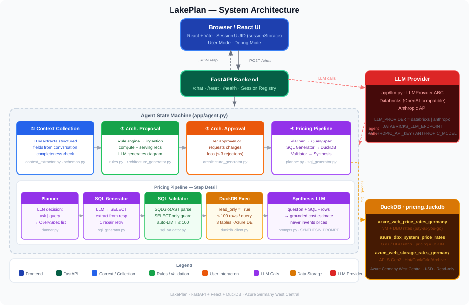

# LakePlan

**A Databricks architecture planning and cost estimation agent.**

LakePlan proposes a Databricks solution architecture for your use case, then estimates what it will cost on Azure Germany West Central. Implemented as a FastAPI backend with a React + Vite frontend.

## What it does

The agent guides users through a structured flow:

1. **Path selection** — user picks one of 5 use-case paths (DWH Migration, Cloud Platform Migration, Real-Time, ML/GenAI, Custom)
2. **Context collection** — conversational Q&A to gather source type, data volume, latency, BI users, etc.
3. **Architecture proposal** — rule engine + LLM generates a Databricks solution architecture; user approves or requests changes
4. **Pricing** — planner decides what to query, SQL generator queries DuckDB, LLM synthesises a cost estimate grounded in real Azure Germany pricing data

## Architecture



## Running with Docker (recommended)

The easiest way to run the agent — no Python or npm required.

### Prerequisites

- [Docker Desktop](https://www.docker.com/products/docker-desktop/) installed and running
- A Databricks personal access token

### Pull and run

**Step 1 — Authenticate with GitHub Container Registry**

You need a GitHub personal access token with `read:packages` scope:
1. Go to **GitHub → Settings → Developer settings → Personal access tokens → Tokens (classic)**
2. Generate new token → check **`read:packages`** and **`repo`**
3. Copy the token and login:

```bash
echo YOUR_GITHUB_TOKEN | docker login ghcr.io -u YOUR_GITHUB_USERNAME --password-stdin
```

**Step 2 — Pull and run**

```bash
docker pull ghcr.io/ruhragency/databricks-pricing-agent:latest
```

**Option A** — use pre-configured workspace and model:

```bash
docker run -p 8000:8000 \
  -e DATABRICKS_TOKEN=<your_databricks_token> \
  ghcr.io/ruhragency/databricks-pricing-agent:latest
```

**Option B** — override the workspace or model:

```bash
docker run -p 8000:8000 \
  -e DATABRICKS_TOKEN=<your_databricks_token> \
  -e DATABRICKS_HOST=https://your-workspace.azuredatabricks.net \
  -e DATABRICKS_LLM_ENDPOINT=your-model-endpoint \
  ghcr.io/ruhragency/databricks-pricing-agent:latest
```

Open http://localhost:8000

### Stop the container

```bash
docker ps                          # find the container ID
docker stop <container_id>
```

---

## Local development setup

**Prerequisites:** Python 3.11+ and Node 18+ (required by Vite 5).

### 1. Install Python dependencies

```bash
pip install -r requirements.txt
```

### 2. Build the frontend

```bash
cd frontend
npm install
npm run build
cd ..
```

Compiled React app outputs to `app/static/`.

### 3. Configure environment

```bash
cp .env.example .env
# Edit .env and fill in credentials
```

### 4. Run

```bash
python -m uvicorn app.main:app --reload
```

Open http://localhost:8000

> **Note**: `--reload` auto-restarts on file changes, which clears all in-memory sessions. Start without `--reload` for stable testing sessions.


## UI modes

**User mode** — clean chat with plain-language answers; no SQL, no table names, no confidence labels.

**Debug mode** — each response shows a collapsible step panel (context extraction, rules fired, LLM calls, SQL + raw data). Pricing output includes full retrieved data tables, confidence label, and missing data section.

Mode is selected on the onboarding screen as a toggle and locks for the session.

## Documentation

- [How It Works & Project Structure](../../wiki/How-It-Works)
- [API Reference](../../wiki/API-Reference)
- [LLM Configuration](../../wiki/LLM-Configuration)
- [Pricing Database](../../wiki/Pricing-Database)
- [Building and Publishing the Docker Image](../../wiki/Building-and-Publishing-Docker-Image)
